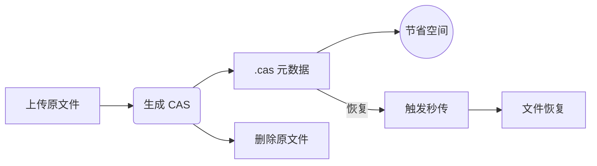

<div align="center">
  

  <p><em>OpenList 是一个有韧性、长期治理、社区驱动的 AList 分支，旨在防御基于信任的开源攻击。</em></p>

  
  <a href="https://github.com/OpenListTeam/OpenList/blob/main/LICENSE"></a>
  <a href="https://github.com/OpenListTeam/OpenList/actions?query=workflow%3ABuild"></a>
  <a href="https://github.com/OpenListTeam/OpenList/releases"></a>

  <a href="https://github.com/OpenListTeam/OpenList/discussions"></a>
  <a href="https://github.com/OpenListTeam/OpenList/releases"></a>
</div>

---
# OpenList-CAS

基于 [OpenList](https://github.com/OpenListTeam/OpenList) 的增强分支，围绕 `.cas` 秒传元数据工作流进行优化，实现**低存储占用 + 快速恢复文件**的高效方案。

---

## ✨ TL;DR

- 📦 **上传文件** → 自动生成 `.cas` 元数据文件
- 🗑️ **删除原文件** → 仅保留 `.cas`，显著节省存储空间
- ⚡ **秒传恢复** → 通过 `.cas` 快速还原原始文件

---

## 📑 目录

* [🧠 核心理念](#-核心理念)
* [🔄 工作流程](#-工作流程)
* [🚀 使用场景](#-使用场景)
* [🔧 核心特性](#-核心特性)
* [📦 支持驱动](#-支持驱动)
* [⚙️ 配置说明](#️-配置说明)
* [🏷️ 命名规则](#️-命名规则)
* [🖥️ 存储驱动说明](#️-存储驱动说明)
* [🐳 部署指南](#-部署指南)
* [🌐 访问](#-访问)
* [⚠️ 重要认知](#️-重要认知必读)
* [⚠️ 风险提示](#️-风险提示)
* [❓ 常见问题](#-常见问题)
* [🔗 与上游项目](#-与上游项目)
* [📜 免责声明](#-免责声明)
* [📜 致谢 & 声明](#-致谢--声明)
* [⭐ Star History](#-star-history)

---


## 🧠 核心理念

> 用“可验证的文件特征”替代“文件本体存储”，在不保留原始数据的情况下，仍然保留文件恢复能力。

---

## 🔄 工作流程


> 上传 → 提取特征 → 删除原文件 → 需要时秒传恢复



---

## 🚀 使用场景

* 📉 **低存储环境（VPS / NAS）**
  仅保存 `.cas`，极大减少空间占用

* ☁️ **网盘秒传优化**
  利用哈希直接恢复文件，避免重复上传

* 🎬 **媒体库归档**
  平时只存元数据，需要时恢复原文件

* 🔁 **自动化工作流**
  监控 `.cas` 文件并自动恢复

---

## 🔧 核心特性

* 自动生成 `.cas` 元数据文件（`Generate cas`）
* 支持生成 `.cas` 后自动删除原文件（`Delete source`）
* 支持通过 `.cas` 秒传恢复原文件（`Restore source from cas`）
* 支持基于当前 `.cas` 文件名恢复文件，并自动补全扩展名（`Restore source use current name`）
* 支持自动监听 `.cas` 文件并恢复原文件，且可在恢复后自动删除 `.cas`（`Auto restore existing cas`）

---

## ⚙️ 配置说明

| 配置项                             | 默认值 | 适用驱动     | 说明             |
| :-----------------------------: | :-: | :-------------------: |:------------:|
|           Generate cas          |  ❌  |          All          | 上传后生成 `.cas` |
|          Delete source          |  ❌  |          All          | 生成后删除原文件     |
|     Restore source from cas     |  ❌  | 189Cloud / 189CloudPC | 通过 `.cas` 恢复 |
| Restore source use current name |  ❌  | 189Cloud / 189CloudPC | 使用当前文件名      |
|     Delete CAS after restore    |  ❌  | 189Cloud / 189CloudPC | 恢复后删除 `.cas` |
|    Auto restore existing cas    |  ❌  | 189Cloud / 189CloudPC | 自动监听恢复       |
| Auto restore existing cas paths |  -  | 189Cloud / 189CloudPC | 指定监听目录       |

---

## 📦 支持驱动

| 驱动                | 支持情况 | 推荐   | 说明         |
|:-------------------:|:--------:|:------:|:------------:|
| 189Cloud / 189CloudPC | ✔️       | ⭐⭐⭐⭐⭐ | 完整支持     |
| Local               | ⚠️       | ⭐⭐    | 仅生成 / 删除 |

---


## 🖥️ 存储驱动说明

### ☁️ 189Cloud / 189CloudPC

支持：

* 生成 `.cas`
* 删除原文件
* 通过 `.cas` 秒传恢复文件
* 自动监听并恢复 `.cas`
* 恢复后自动清理 `.cas`

说明：

* 依赖云盘的 **哈希秒传能力**
* 恢复速度取决于云端是否已存在相同文件
* 不会上传 `.cas` 内容本身，而是触发秒传机制

---

### 💻 Local（本地存储）

**支持功能：**

- 生成 `.cas` 文件
* 删除原文件

不支持：

* 秒传恢复

说明：

* 本地磁盘不具备“哈希秒传”能力
* `.cas` 仅用于节省存储空间，不能用于恢复文件

---

## 🐳 部署指南

> 💡 默认端口：`5244`
> 💡 数据目录：`/opt/openlist/data`
> 💡 首次启动时，请从容器日志中获取管理员密码

---

### Docker

```bash
docker run -d --restart=unless-stopped \
  -v /etc/openlist:/opt/openlist/data \
  -p 5244:5244 \
  -e PUID=0 \
  -e PGID=0 \
  -e UMASK=022 \
  --name="openlist-cas" \
  freeyua/openlist-cas:latest
```

---

### Docker Compose

```yaml
services:
  openlist-cas:
    image: freeyua/openlist-cas:latest
    container_name: openlist-cas
    restart: unless-stopped
    ports:
      - "5244:5244"
    volumes:
      - ./data:/opt/openlist/data
    environment:
      - PUID=0
      - PGID=0
      - UMASK=022
```

---

## 🌐 访问

```
http://localhost:5244
```

---

## ⚠️ 重要认知（必读）

###  `.cas` **仅包含文件的特征索引，不包含实际数据**：

- ✔️ **可恢复**：云盘中仍存在该文件（能命中秒传）
- ❌ **不可恢复**：云盘中的文件被删除、失效或被风控
- 👉 **请勿将 `.cas` 作为唯一备份方案**，否则可能导致数据永久丢失

---

## ⚠️ 风险提示

- 强依赖云盘的秒传能力
- 云盘策略变化可能影响恢复功能
- 不适用于长期数据的唯一存储

---

## ❓ 常见问题

### ❗ 上传 `.cas` 没反应

未开启 `Restore source from cas`，或当前驱动不支持恢复功能。

---

### ❗ 无法恢复文件

可能原因：

* 当前驱动不支持秒传（如 Local）
* 云端不存在该文件（未命中秒传）
* 云盘策略限制或风控导致失败

---

### ❗ 文件名或后缀不正确

检查是否开启：

`Restore source use current name`

* 开启：使用当前 `.cas` 文件名恢复（自动补全扩展名）
* 关闭：使用 `.cas` 内记录的原始文件名

---

### ❗ `.cas` 是备份吗？

不是。

`.cas` 仅包含文件特征信息，不包含实际数据，仅用于触发秒传恢复。


---

### ❗ 为什么 Local（本地存储）无法恢复？

本地存储不具备“哈希秒传”能力。

`.cas` 在 Local 中仅用于生成和删除，无法用于恢复文件。

---

### ❗ 恢复后 `.cas` 文件没有被删除？

请检查是否开启：

`Delete CAS after restore`

---

### ❗ 可以只保存 `.cas` 删除原文件吗？

可以，但存在风险：

* 若云端文件被删除或失效，将无法恢复
* 不建议作为唯一备份方案

---

### ❗ 如何实现自动恢复 `.cas` 文件？

开启：

`Auto restore existing cas`

并配置监听目录：

`Auto restore existing cas paths`


---

## 🔗 与上游项目

* 上游：[OpenList](https://github.com/OpenListTeam/OpenList) 
* 本项目为非官方增强分支

---

## 📜 免责声明

1. 本项目仅用于学习与技术研究，请遵守相关法律法规，请勿用于商业用途。
2. 本项目所涉及的任何脚本、程序或资源，仅用于测试和研究目的。
3. 使用者应在下载后的24小时内删除相关文件。
4. 使用者需自行承担使用本项目可能产生的一切法律后果和风险，作者不承担任何责任。
5. 如果您不能接受本声明的任何条款，请立即停止使用本项目。

---

## 📜 致谢 & 声明

* 感谢原项目 [OpenList](https://github.com/OpenListTeam/OpenList) 提供的基础能力。
* 本项目为非官方增强分支

⚠️ **仅供学习研究，请遵守法律法规**

---

## ⭐ Star History

如果这个项目帮到了你，欢迎点个 ⭐ 支持！

